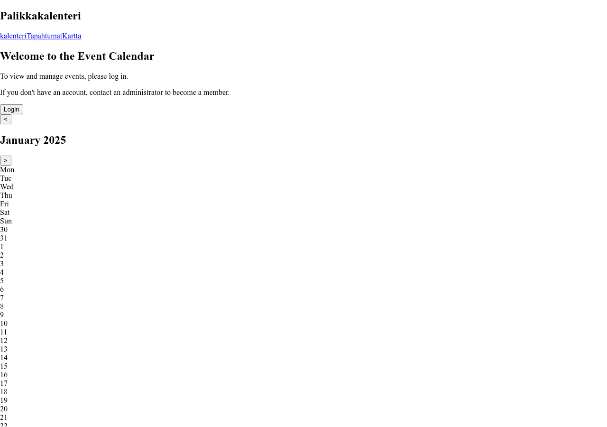
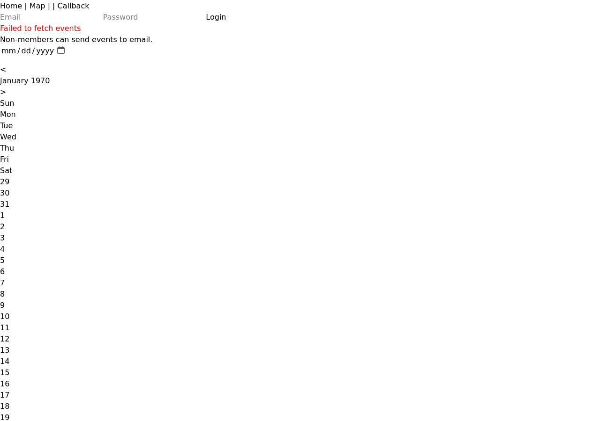

# Application Screenshots

These screenshots are automatically generated for documentation purposes.

## Public Views

| Screenshot | Description |
|------------|-------------|
|  | Main calendar view showing monthly overview |
|  | Calendar view on mobile viewport |
|  | Calendar with navigation controls highlighted |

## Authenticated Views

These views require user authentication.

| Screenshot | Description |
|------------|-------------|
|  | Event creation form |
|  | List of existing events (admin view) |

## Regenerating Screenshots

Run the following command to regenerate all screenshots:

```bash
devenv shell -- pnpm generate-screenshots
```

**Note:** The development server must be running (`pnpm dev`) and authentication
screenshots require a valid authenticated session.

## Viewport Sizes

- Desktop: 1280x900
- Mobile: 375x667
